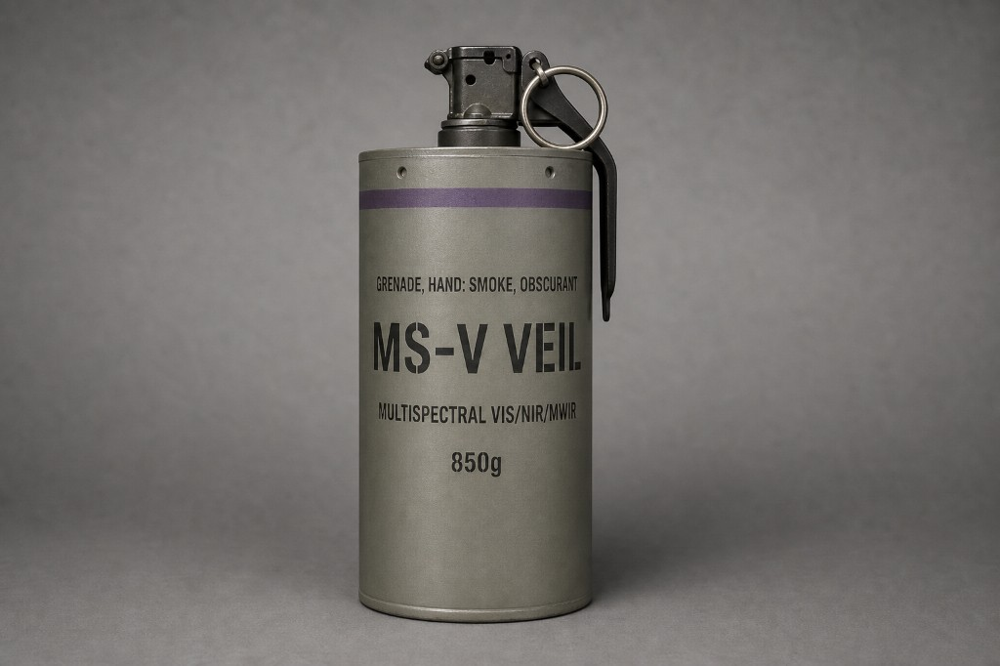
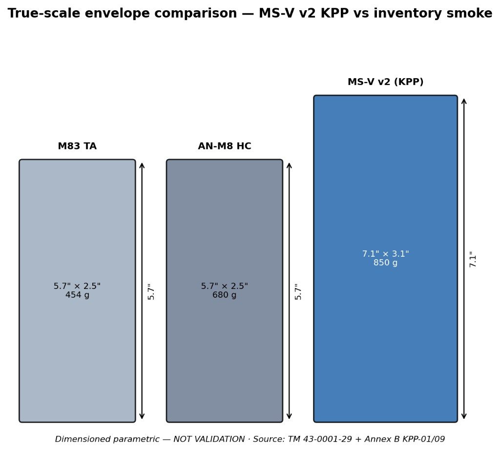
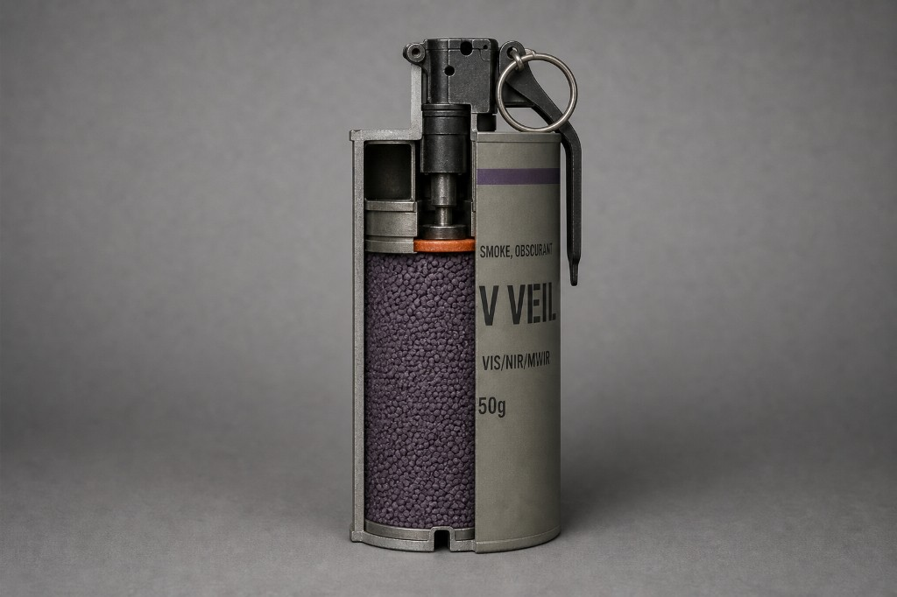

# MS-V Veil — Multispectral Obscurant Grenade

**Squad-Layer Drone Manipulation — Hand-Thrown · Pin-Pull · VIS + IR**

**MS-V** generates a dense **visual + infrared** cloud to break fused FPV/thermal UAS lock when paired with standard visual smoke. Carried **in addition to** inventory smoke. Employed as **2–3 MS-V + visual smoke** against FPV and fiber-optic guided drones.

**Status:** TRL 2 — Sensitivity study complete (140M samples)  
**Version:** 2.0.0

> **Conceptual design — NOT validation.** Literature-parameter M&S only.  
> **Master plan:** [MasterPlan.md](MasterPlan.md) · **One-pager:** [Executive Brief](docs/00-executive-brief.md)

**Repository:** https://github.com/Fratres-X-AI/MS-V

---

## Concept art (authoritative v2 KPP)

| **Product hero** | **True-scale vs inventory** | **Cutaway interior** |
|:---:|:---:|:---:|
|  |  |  |

**850 g · 7.1" × 3.1" · Concept visualization only — NOT VALIDATION**  
Full catalog: [visuals/README.md](visuals/README.md) · Spec: [V2-KPP-SPEC](visuals/grenade/V2-KPP-SPEC.md)

---

## Core vision

Inventory smoke hides you from the eye. **Thermal imagers see through AN-M8.** Fiber-optic drones don't jam. MS-V adds the **IR channel** standard smoke lacks — a **squad-portable multispectral screen** without new launchers or kill chains.

**Philosophy:** Soldier-first · Complementary to visual smoke · Honest trades · Literature-bound M&S

---

## Locked specifications (v2 KPP)

| Item | Spec | Status |
|------|------|--------|
| **Role** | Squad-layer obscuration vs fused EO/IR UAS | Locked |
| **Mass** | **850 g** (v2 KPP envelope) | Design authority |
| **Envelope** | **7.1 × 3.1 in** (180 × 79 mm) | Design authority |
| **Spectrum** | **VIS + NIR + MWIR** | Locked |
| **Duration (KPP)** | **≥ 120 s** dense | M&S pass (literature bounds) |
| **Employment** | **2–3 MS-V + visual smoke** | Locked |
| **Throw (KPP-08)** | **≥ 20 m** (objective 25 m) | MC + model; range TBD |
| **Fuze** | **M201A1-compatible** | Locked |
| **Build-up** | **≤ 15 s** p90 | M&S pass |
| **Cost target** | **$75–150** at scale | PLANNED — no cost model |

### Validated vs notional (summary)

| Item | Status |
|------|--------|
| 140M mega suite, RTM traceability, Sobol, CONOPS | **Complete (M&S)** |
| Duration/MoE at literature bounds | **Statistical sensitivity pass** |
| Authoritative v2 concept art | **Locked (SHA256-pinned)** |
| Fill α(λ), burn rate, tox, throw (empirical) | **Notional / untested** |
| Field validation, military ready | **Forbidden claim** |

Full matrix: [rtm/verification_matrix.md](rtm/verification_matrix.md)

---

## M&S evidence (140M samples)

| Metric | Value | Source |
|--------|-------|--------|
| Mega suite | **38/38 pass** | `phase2_v1_full_physics` + v6 probabilistic lock |
| Duration p10 (3× g3) | **~170 s** (+42% vs 120 s KPP) | verification matrix |
| MoE lock-break ≥60 s | **80%** nominal · **55%** adversarial | mega suite (discriminative) |
| Top Sobol driver | **burn_rate** ST ≈ 0.83 | SOBOL report |

```bash
pip install -r requirements-lock.txt
python -m sim.reproduce              # golden checksum gate
python sim/run_suite_local.py        # 100k local suite
python sim/run_mega_suite.py --quick # CI-scale smoke
```

Full campaign: [RUNPOD.md](RUNPOD.md) · Reproduce: [REPRODUCE.md](REPRODUCE.md)

---

## Comparison snapshot

| | AN-M8 HC | **MS-V Veil (v2)** |
|--|----------|---------------------|
| Weight | 680 g | **850 g** |
| Spectrum | VIS | **VIS + NIR + MWIR** |
| vs thermal UAS | Transparent | **Attenuation (concept)** |
| Employment | As needed | **2–3 + visual smoke** |
| TTP | Pin-pull throw | **Same** |

Data: [`data/baseline_grenades.json`](data/baseline_grenades.json)

---

## Layered defense

```
Detect → EW → MS-V + smoke → kinetic window
```

See [CONOPS](docs/04-conops-use-cases.md) · [Limitations](docs/07-limitations-and-risks.md)

---

## Document map

| # | Document |
|---|----------|
| 00 | [Executive Brief](docs/00-executive-brief.md) |
| 01 | [Concept Overview](docs/01-concept-overview.md) |
| 02 | [Operational Requirements](docs/02-operational-requirements.md) |
| 03 | [Design Constraints](docs/03-design-constraints.md) |
| 04 | [CONOPS / Use Cases](docs/04-conops-use-cases.md) |
| 05 | [Key Design Trades](docs/05-key-design-trades.md) |
| 06 | [System Description](docs/06-system-description.md) |
| 07 | [Limitations and Risks](docs/07-limitations-and-risks.md) |
| 08 | [Layered Defense Integration](docs/08-layered-defense-integration.md) |
| **10** | [Phase 1 Prototype Gates](docs/10-phase-1-prototype-gates.md) |
| **11** | [Partner Validation & TRL Gates](docs/11-partner-validation-and-trl-gates.md) |

| Annex | Topic |
|-------|--------|
| A–E | [Baseline, KPPs, trades, threats, references](annexes/) |
| **F** | [Form factor & ergonomics](annexes/F-form-factor-and-ergonomics.md) |

| RTM / analysis | Purpose |
|----------------|---------|
| [verification_matrix.md](rtm/verification_matrix.md) | KPP/MoE ↔ 38 job IDs |
| [MEGA_SUITE_REPORT.md](analysis/MEGA_SUITE_REPORT.md) | 140M campaign summary |
| [SOBOL_SENSITIVITY_REPORT.md](analysis/SOBOL_SENSITIVITY_REPORT.md) | Global sensitivity |
| [CONOPS_REPORT.md](analysis/CONOPS_REPORT.md) | Five use cases |

### Outreach & partner handoff

| Doc | Purpose |
|-----|---------|
| [One-pager](docs/MS-V-one-pager.md) | Single-page concept summary |
| [Pitch deck outline](docs/pitch-deck-outline.md) | 8–10 slide structure |
| [Licensing & partnership](docs/licensing-and-partnership.md) | Prime teaming, IP tiers, inquiry path |
| [LinkedIn brief](analysis/LINKEDIN_CAMPAIGN_BRIEF.md) | Post copy + image URLs |

---

## Open questions

- Fill chemistry down-select (Option A/B/C — Annex C)  
- Empirical α(λ) and burn rate for MS-V formulation  
- Toxicology margin vs stronger IR performance (KPP-12)  
- Unit cost model vs $75–150 target (KPP-13)  
- UAS surrogate lock-break vs planning MoE surrogate (A-013)  

---

## License & prime partnership

| Tier | Document |
|------|----------|
| **Open concept** | [LICENSE](LICENSE) — MIT (docs, M&S, art) |
| **Prime / Program** | [LICENSE-COMMERCIAL.md](LICENSE-COMMERCIAL.md) — development & production under PCA |

**Teaming with a prime or fill vendor?** [Licensing & partnership](docs/licensing-and-partnership.md) · [Partnership inquiry](https://github.com/Fratres-X-AI/MS-V/issues/new?template=partnership_inquiry.yml)

All specs, M&S outputs, and art are **notional**; not authorization to procure, manufacture, export, or field any munition or obscurant system.
