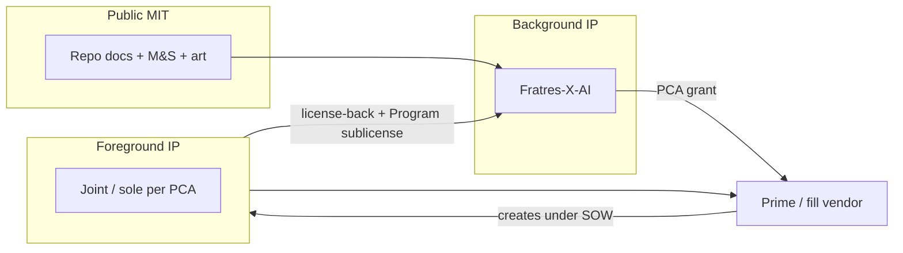

# Licensing & Prime Partnership

**MS-V Veil · TRL 2 · v2.0**  
**Audience:** Business development, contracts, and engineering leadership at U.S. defense primes, pyrotechnic vendors, and integrators.

---

## Why this repo is structured for prime collaboration

MS-V is published as an **open concept** so the community can review the trade space,
while **production rights, patents, trademarks, fill formulations, and Program-specific exclusivity**
are handled through a **Prime Collaboration Agreement (PCA)**.

That split is intentional:

| Goal | Mechanism |
|------|-----------|
| Transparency & capture support | Public **MIT** license on docs, models, and art |
| Prime can evaluate without fear of “toxic” terms | Clear **evaluation** tier; NDA optional |
| You keep control of the concept | **Background IP** stays with Fratres-X-AI unless assigned |
| Partner can invest in fill + range validation | Negotiated **development** and **production** licenses |
| Government deliverables stay clean | **Foreground IP** and FAR/DFARS flow-down in PCA |

Full legal template: [LICENSE-COMMERCIAL.md](../LICENSE-COMMERCIAL.md).

---

## What you get at each tier

### Evaluation (no fee; standard NDA optional)

- Internal use of README, annexes, RTM, 140M M&S evidence, and concept art for **capture, trade study, and architecture reviews**
- Reproduce Monte Carlo statistics via `python -m sim.reproduce` and committed manifest
- No right to represent MS-V as your product without written approval
- No production, export, or fielding authorization

**Start here:** clone the repo or download release tag `v2.0.0`; open a [partnership inquiry](https://github.com/Fratres-X-AI/MS-V/issues/new?template=partnership_inquiry.yml).

### Development (PCA required)

Typical scope:

- Fill formulation bench tests (burn cup, α(λ), PSD) per [`analysis/fill_physics_test_plan.md`](../analysis/fill_physics_test_plan.md)
- Prototype grenade body, fuze interface, throw range under load
- UAS surrogate lock-break range tests
- Joint test plans and configuration control against `models/cloud_physics/params.yaml`
- **Foreground IP** framework (joint vs sole invention) defined up front

Typical license shape:

- **Non-exclusive** development license on Background IP for the named Program, **or**
- **Limited exclusive** field (e.g. U.S. Army squad counter-UAS obscurant prototype) for a defined period

### Production (PCA + Program)

Typical scope:

- Manufacture and deliver articles for a **named government contract**
- Sublicense or exclusive **field-of-use** for agreed configuration (fill chemistry, marking, fuze variant)
- Patent and trademark licenses aligned to deliverables

---

## IP at a glance

---

## What MIT does and does not do

**MIT allows:** copy, modify, merge, publish, and distribute the repository for any purpose with attribution.

**MIT does not grant:**

- Trademark use for **MS-V** or **Veil**
- Patent license for future filings on Background or Foreground IP
- **Exclusive** production rights
- **Export** or **fielding** authorization for munitions or obscurants
- Representation that M&S figures are validated or procurement-ready

Primes that need those rights should pursue **Tier B** in [LICENSE-COMMERCIAL.md](../LICENSE-COMMERCIAL.md).

---

## Suggested teaming patterns

| Pattern | When it fits |
|---------|----------------|
| **Concept licensor + prime integrator** | Prime leads prototype and government customer; Fratres-X-AI licenses Background IP and supports architecture |
| **Fill vendor + prime** | Vendor owns pyrotechnic Foreground IP; PCA covers Background IP + test data handoff |
| **OTA / prototype consortium** | Background IP license + joint Foreground IP per task order |
| **Government lab + prime** | Lab for bench/range; PCA among Fratres-X-AI and prime for deliverable IP |

---

## Due diligence package (in-repo)

| Artifact | Location |
|----------|----------|
| System overview | [06 — System Description](06-system-description.md) |
| One-pager | [MS-V-one-pager.md](MS-V-one-pager.md) |
| Pitch outline | [pitch-deck-outline.md](pitch-deck-outline.md) |
| 140M evidence | [MEGA_SUITE_REPORT.md](../analysis/MEGA_SUITE_REPORT.md) |
| Verification matrix | [rtm/verification_matrix.md](../rtm/verification_matrix.md) |
| Global sensitivity | [SOBOL_SENSITIVITY_REPORT.md](../analysis/SOBOL_SENSITIVITY_REPORT.md) |
| Form factor / ergonomics | [Annex F](../annexes/F-form-factor-and-ergonomics.md) |
| Authoritative visuals | [visuals/README.md](../visuals/README.md) |
| Fill test plan | [fill_physics_test_plan.md](../analysis/fill_physics_test_plan.md) |
| TRL gates | [trl_gate_external.md](../proposals/trl_gate_external.md) |
| Commercial terms template | [LICENSE-COMMERCIAL.md](../LICENSE-COMMERCIAL.md) |
| Partner data schema | [partner_validation_results.template.json](../data/partner_validation_results.template.json) |

---

## Next step

**[Open a partnership inquiry →](https://github.com/Fratres-X-AI/MS-V/issues/new?template=partnership_inquiry.yml)**

Include: company name, intended **Program or customer**, desired tier (evaluation / development / production), scope (fill, body, range, full system), and timeline.

---

*Notional engineering study. Not legal advice. Not authorization to procure or field any system.*
